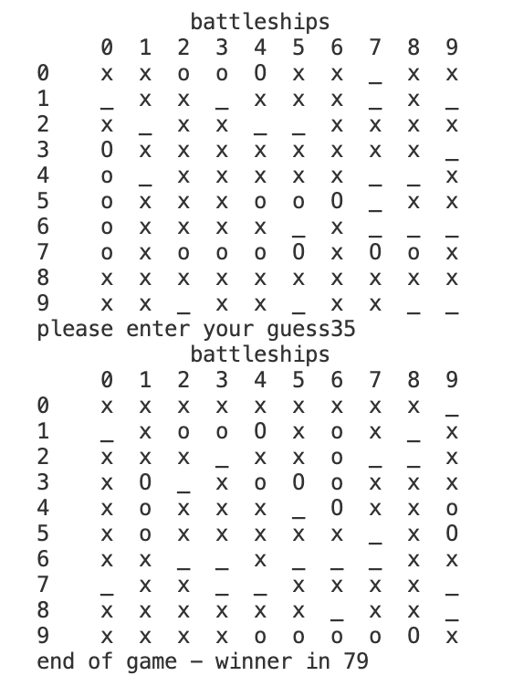

# Battleships game

## How to play

* The purpose of the game is to discover all the "o" marked numbers in the board and sink the other opponents ships and the opponent is the computer in this game.

* First steps in the game is to enter your ships length where you choose 6 different ships.

* The board has number 0-99 where you can place out the ships and th sizes of the ships are: 5,4,3,3,2,2 in terms of length of the board.

* The user guesses where the computer opponent has placed their ships by entering a number between 0-99.

* The user cant guess the same number twice and everytime the user has guessed a number he or she will see that number on the board marked with an "x". If the user guessed the right number they will see the board marked with an "o".

* The game informs the user if the user won or the computer and it will also tell them how attempts  it took them.

## Existing features

## Future features

## Data model

## Testing

## Bugs

## Remaining bugs

## Validator testing

## Deployment

## Credits

* The majority of the code was taken or inspired directly or indirectly through https://drcodie.com/

