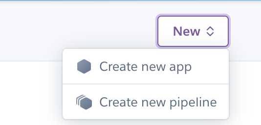

# Battleships game

## How to play

* The user's goal is to sink all the opponents ships by guessing a number between 0-99 on the enemy board. The ships are marked with a "o" symbol and if the user misses then the mark will be a "x" symbol. When the user has hit all the segments of a ship then the symbol "O" will be shown for that specific ship.

* The game starts with user creating/placing their ships as a row or in a vertical line in different index sizes.

* Once the user have created his board of ships, the user will be able to see a prewiew of the user's board.

* When the user has made the first guess two boards get's created where the enemys board is on the top and the users board is at the bottom with ships included.

* The first player who hits all the segments of the total ships will win.

## Features

* In this version the battleships game the user can create their own board. This point is a little bit unique since a lot of battleships game has random generated boards through their code.

* The board consists of the index numbers 0-99 which makes the board have a decent size and a well timed playing adventure.

* The game has clear guidelines, rules and information which improves the understanding of the game.

* The code has a function called "def calc_tactics" which makes the game more interactive for the user since the function hits the indexes nearby a hit segment of the ships.

* Once the game is over the game explains who won which is either the user or the computer.

## Overall features

* The game was created with the programming language: Python.

* The background color and the color of the numbers and letters was created with colorama in Python.

## Future features

* Adding names for each board to improve clarity.

## Testing

* The testing of the game has been made through the deployed version in Heroku here: https://battleships-thomas-6fa1020603a4.herokuapp.com/

| Action                              | Expectation                                       | Pass/Fail  |
|-------------------------------------|---------------------------------------------------|------------|
| Enter coordinates with number 0-99  | User is being asked to place the next number and, | Pass       |
|                                     | cordinate is placed.                              |            |
| Enter coordinate with letter        | Error message: Please enter a valid number.       | Pass       |
| Enter repeated coordinate           | Error message: error - please try again.          | Pass       |
| Enter coordinate 0-99 while the     | Expect to see and x mark if it's a miss or o if   | Pass       |
| game is running/board created.      | it's a hit.                                       |            |
| Enter a letter while the  game is   | Error message: Please enter a valid number.       | Pass       |
| running/board created.              |                                                   |            |
| Enter repeated coordinate while the | Error message: incorrect number, used before.     | Pass       |
| game is running.                    |                                                   |            |
| Last shot is done from either       | Stops the game and announces the winner.          | Pass       |
| computer or user.                   |                                                   |            |
* Some tests has been made through the website Amiresponsive: 

https://ui.dev/amiresponsive

https://ui.dev/amiresponsive?url=https://battleships-thomas-6fa1020603a4.herokuapp.com/

* Some tests has been made through Code Institute's python code checker: https://pep8ci.herokuapp.com/

## Bugs

* Potential bug: Code Institute's python validator software shows plenty of white space errors which i can't figure out since the indentation and the software is working currently.

## Deployment

* The deployment was made through github and Heroku. The step by step process where the following on github: Settings --> Pages --> Source --> Deploy from a branch --> Main --> /(root) --> Save.

The depoyment though Heroku was made using the following steps: 

1. first i typed pip3 freeze > requirements.txt.

2. I clicked on the New button, then create app, choosed a unique name, picked Europe as a region and then pressed the button create app.

3. I clicked on the settings tab, scrolled down, added buildpacks for python first and node.js as the secondary buildpack and clicked save changes for each buildpack.

4. I clicked on the deploy tab, then pressed to connect with github, after that i searched for my repository and clicked on the connect button in order to link up the Heroku app with the repository code.

5. As a last step i scrolled down to the bottom of the deploy tab and pressed deploy branch which is a manually deployment process through Heroku.

## Credits

* The majority of the code was taken or inspired directly or indirectly through DrCodie's youtube channel: https://www.youtube.com/@DrCodie

* Here is a link to Dr Codie's website: https://drcodie.com/

* Some of the code was taken or inspired directly or indirectly through this video: https://www.youtube.com/watch?v=Ej7I8BPw7Gk&list=PLpeS0xTwoWAsn3SwQbSsOZ26pqZ-0CG6i

* Some of the code was taken or inspired directly or indirectly through this video: https://www.youtube.com/watch?v=EziS2eGZGz4&list=PLpeS0xTwoWAsn3SwQbSsOZ26pqZ-0CG6i&index=2

* Some of the code was taken or inspired directly or indirectly through this video: https://www.youtube.com/watch?v=r9yXpel08AA&list=PLpeS0xTwoWAsn3SwQbSsOZ26pqZ-0CG6i&index=3

* Some of the code was taken or inspired directly or indirectly through this video: https://www.youtube.com/watch?v=RqyR-naxh60&list=PLpeS0xTwoWAsn3SwQbSsOZ26pqZ-0CG6i&index=4

* Some of the code was taken or inspired directly or indirectly through this video: https://www.youtube.com/watch?v=aMLSS-JVYZk&list=PLpeS0xTwoWAsn3SwQbSsOZ26pqZ-0CG6i&index=5

* Some of the code was taken or inspired directly or indirectly through this video: https://www.youtube.com/watch?v=GmWHhAGvaQA&list=PLpeS0xTwoWAsn3SwQbSsOZ26pqZ-0CG6i&index=6

* Some of the code was taken or inspired directly or indirectly through Code Institute's Full Stack Developer course which is not accessed to the public except if you are a student. Here is a link to Code Institute's website: https://codeinstitute.net/